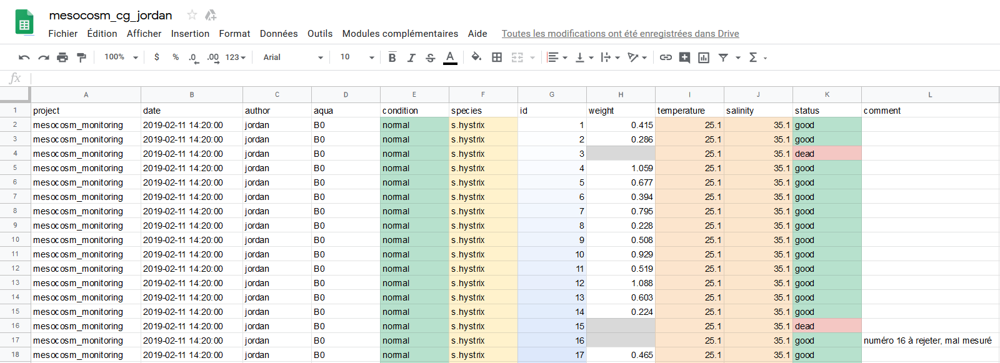
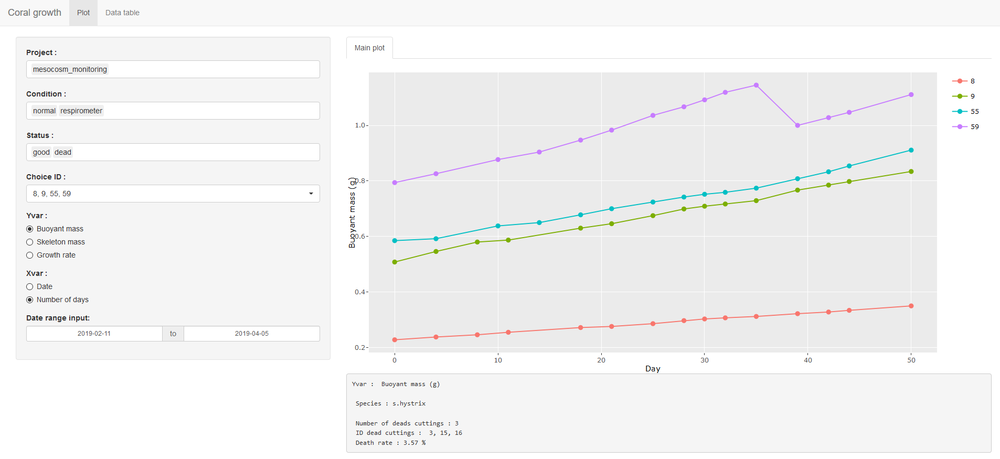
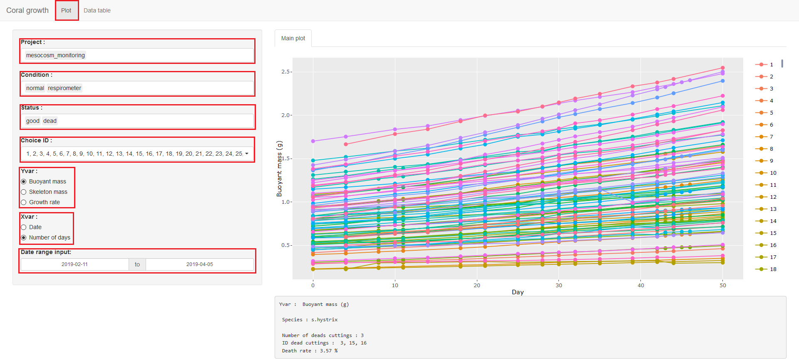
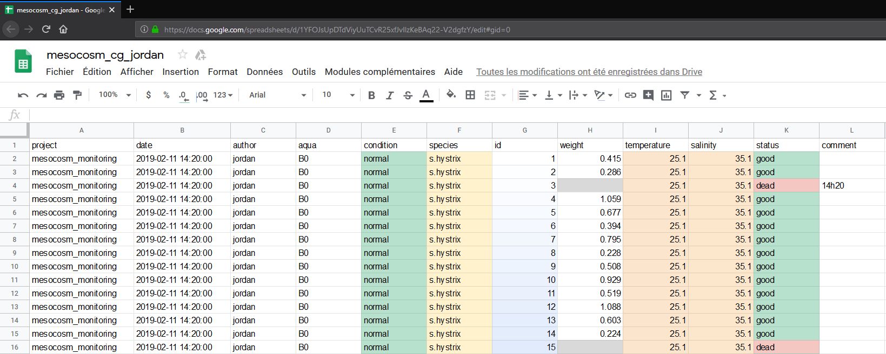

--- 
title: "Bookdown d'aide pour l'application 'CoralGrowth'"
author: "Benrezkallah Jordan"
date: "`r Sys.Date()`"
bibliography:
- book.bib
- packages.bib
description: Page d'aide pour l'application Coral Growth
documentclass: book
link-citations: yes
site: bookdown::bookdown_site
biblio-style: apalike
---

```{r include=FALSE}
# automatically create a bib database for R packages
knitr::write_bib(c(
  .packages(), 'bookdown', 'knitr', 'rmarkdown'
), 'packages.bib')


```


# Utilisateur
L'application *Coral Growth* permet de suivre l'évolution de la croissance de boutures de corail à partir de l'URL d'un Googlesheets.

L'application est disponible à l'adresse suivante : https://jack177.shinyapps.io/coralgrowth/

```{r, echo=FALSE}
knitr::include_app("https://jack177.shinyapps.io/coralgrowth/", 
  height = "800px")
```


Ce chapitre est destiné à ceux désirant de comprendre l'utilisation de l'application.
Dans le chapitre, il y aura des explications destiné à ceux voulant comprendre le fonctionnement de l'application.

## Tableur Googlesheets
Afin de mieux comprendre comment fonctionne l'application, il est important de connaître le jeu de donnée (dataframe).

Le tableur est divisé en 12 colonnes :

+ project : différencie chaque expérience réalisée, généralement on recréera un nouveau tableur pour chacune des expériences
+ date : date et heure à laquelle les relevés de mesures ont été pris
+ author : nom de la personne ayant encodé dans le tableur
+ aqua : nom du mésocosme où la bouture a été prélevé
+ condition : condition spécifique appliquée à la bouture (exemple : stress hypersalin)
+ species : nom de l'espèce mesurée
+ id : numéro de la bouture mesurée
+ weight : masse immergée mesurée
+ temperature : température de l'eau de mer
+ salinity : salinité de l'eau de mer
+ status : état de santé de la bouture
+ comment : commentaire




## Onglet graphique
Le premier onglet "Plot", permet la visualisation sous forme de graphique de la croissance du corail. 



## Paramètres
On peut filtrer sur différents paramètres : 

+ projet
+ condition
+ statut
+ ID 
+ Yvar 
+ Xvar
+ période de temps



Les 3 premiers paramètres **project**, **condition**, **status** peuvent être sélectionné depuis un menu déroulant, pour supprimer une valeur il suffit de cliquer sur la valeur et d'appuyer sur la touche *SUPPR*.

Le choix des **ID** se fait via un menu déroulant qui permet de les sélectionner un par un ou de tout sélectionner/désélectionner.

**Yvar** permet de calculer le graphique en fonction de l'ordonnée désirée. 
*Buoyant mass* correspond à la masse immergée brute de la bouture.
<br/>
*Skeleton mass* correspond à la masse squelettique de la bouture. Elle est calculée à partir de la masse immergée, de la salinité et de la température à l'aide de la formule ci-dessous mise au point par Jokiel *et al* (1978) :
\begin{equation}
\large
  m_{squelettique} = \frac {m_{immerge}}{ \frac{1 - \rho_{eau}}{ \rho_{squelettique}}}
\end{equation}
$\rho_{eau}$ est déterminé via l'équation d'état de l'eau de mer grâce à la mesure de la salinité et de la température.
Le $\rho_{squelettique}$ est la densité de l'aragonite(CaCO~3~) <!-- # \chemform{CaCO_3} -->du squelette du corail.

<br/>
*Growth rate* correspond au taux de croissance. Elle est calculée à partir de la masse squelettique et de la date :

\begin{equation}
\large
  Rate_{Growth} = \frac {m_{squelettique(n)}- m_{squelettique(n-1)}}{ \frac{m_{squelettique(n-1)}}{time(n) - time(n-1)}}
\end{equation}

**Xvar** permet de calculer le graphique en fonction de l'abscisse désirée.
*Date* correspond à l'affichage en fonction du jour au format *MMM-dd* (exemple :Feb 15).
*Number of days* correspond à l'affichage en fonction du nombre de jours écoulés depuis la première date.
Il y a un arrondi au jour près.

**Date range input** permet de sélectionner une période donnée.

## Graphique

En passant son curseur sur les points du graphique, on peut obtenir des informations supplémentaires.
On peut également désélectionner les lignes en cliquant sur le numéro associer à la couleur de l'ID à droite de l'écran.


En bas du graphique des informations supplémentaires sont données :

+ Yvar :  l'ordonnée du graphique
+ Species : l'espèce des boutures 
+ Number of deads cuttings : le nombre de boutures mortes
+ ID dead cuttings : l'ID des boutures mortes
+ Death rate : le taux de mortalité

<br/>

### Onglet tableau de donnée

Le deuxième onglet "Data table", permet de visualiser le tableau de donnée, certaines colonnes ont été calculées. 
On peut le trier en fonction de chacune des colonnes.<br/><br/>

<br/><br/>

## Accéder à l'application
Il est possible d'accéder à l'application depuis cette URL : https://jack177.shinyapps.io/coralgrowth/ 

Ou en scannant ce QRcode :

<br/>


# IT

Ce chapitre permet de comprendre la création de l'application **CoralGrowth**.
## Structure du code
L'application est divisée en deux fichiers : ui.R et server.R .

Le script ui.R contient tous les éléments à afficher à l'utilisateur.  <br/>
Le script server.R contient toute la partie logique (importation du jeu 
de donnée, transformation, calculs, ...) .

Les noms des variables ont un sens pratique :


+ ui_nom_de_variable : variable seulement utilisée dans le script ui.R .
+ u_nom_de_variable : variable crée dans ui.R, utilisé dans server.R .
+ s_nom_de_variable : variable crée dans server.R, utilisé dans server.R .

Les variables "*uiOutput*" sont un peu spéciales, elles sont crées dans ui.R, 
pour être configuré dans server.R . <br/>
L'intérêt est d'y insérer des variables retravaillées dans le script server.R .
Ce qui n'est pas possible si elles avaient été directement paramétrer dans ui.R .<br/>
Elles sont paramétrées dans server.R comme n'importe quelle 
variable *nomInput* (inputId, label, ...).

## server.R
### Importation

L'adresse URL est contenue dans la variable coral_url. 
L'URL est générée via un fichier en ligne Google sheets. <br/> <br/>

<br/><br/>

Pour cela il faut aller dans *Fichier > Publier sur le web*, puis choisir :
*Intégrer > Valeurs séparées par des virgules (.csv)*. <br/><br/>
 
<br/> 
_______________________________________________________________________________
<br/>


Le lien de partage au format csv contenu dans *coral_url* sera lu par la 
fonction *read_csv*. Cette fonction va importer le tableau de donnée et les 
mettre au bon format. 
Une grande source d'erreur provient de l'importation,
il est important de respecter le nom des colonnes, ne pas jouer avec le format
des colonnes, surtout pour la date qui devient facilement un problème. <br/>
Dans le tableau de donnée de base, la plupart des colonnes ont 
le format "texte brute", seuls les colonnes 
"id", "weight", "temperature" et "salinity" ont un format numérique.

## À notifier

### Colonne ratio
La colonne *ratio* est calculée à partir de la première valeur encodée de 
la masse squelettique avec la valeur suivante pour chacun des ID.

Si certaines valeurs n'ont pas été rentrées lors de la première date, le ratio 
ne peut être calculé.

### Colonne delta_date
La colonne *delta_date* est une valeur arrondie au jour près.  

### Variable dateRangeInput
La variable *dateRange* possède une plage minimum qui débute avec la date la 
plus ancienne et maximum qui est la date actuelle de l'ordinateur.


## À améliorer
L'application n'est pas parfaite, elle pourrait être encore plus utile.
Je mets ici quelques idées et indices.

### Lecture de plusieurs dataframes
Il serait intéressant de pouvoir utiliser plusieurs jeux de données à la fois et de les comparer entre eux.

La fonction *switch* pourrait permettre de lire plusieurs dataframes.

### URL dynamique
L'URL du tableur en ligne est directement tappé dans le script du fichier server.R.
Il serait plaisant de pouvoir insérer l'URL de n'importe quel tableur directement depuis l'application.

On peut laisser un jeu de donnée par défaut.

### Autres graphiques
Un seul type de graphique à été utilisé, il serait intéressant d'essayer d'autres visualisations.

